Bhai maine AppointHub wale README ka format dekha aur Nexora jaisa same professional structure me bana diya hai. Isko direct `README.md` me paste kar de.

Maine:

* Same heading style rakha hai
* Badges add kiye hai
* Overview professional banaya hai
* Features ko SaaS README jaisa organize kiya hai
* Screenshots paths tere `src/assets` ke hisab se rakhe hai
* Tech stack + folder structure + install + author same format me rakha hai

````md
<div align="center">

# 🛍️ Nexora

### Premium Modern E-Commerce Platform

A modern and fully responsive e-commerce platform built with **React.js**, **Tailwind CSS**, **Zustand**, and **React Query** featuring premium UI, smooth animations, authentication, admin dashboard, product management, shopping workflow, and modern shopping experiences.

<br>

[](https://react.dev)
[](https://vitejs.dev)
[](https://tailwindcss.com)
[](https://zustand-demo.pmnd.rs)
[](https://vercel.com)

<br>

🌐 **Live Demo**

https://modern-ecommerce-virid.vercel.app/

💻 **GitHub Repository**

https://github.com/gayatripixel/modern-ecommerce


</div>


---

# 🎯 Overview

Nexora is a premium modern e-commerce platform designed to provide a smooth online shopping experience with beautiful UI, advanced product features, authentication, and admin management.

The application includes complete shopping functionality like product browsing, wishlist, cart management, checkout flow, order tracking, product comparison, recently viewed products, and a powerful admin dashboard.

Built using modern frontend technologies, Nexora focuses on performance, responsiveness, reusable components, and clean architecture.


---

# ✨ Features


## 🛒 Shopping Experience

- Premium Landing Page
- Product Listing
- Product Details Page
- Product Search
- Category Filtering
- Wishlist Management
- Shopping Cart
- Product Comparison
- Recently Viewed Products
- AI Inspired Product Recommendations
- Quick View Product Modal
- Rating & Review System


---


## 💳 Checkout System

- Complete Checkout Flow
- Shipping Details
- Coupon Discount System
- Flash Sale
- Limited Stock Indicator
- Order Summary
- Multiple Payment Options
- Order Success Page


---


## 📦 Order Management

- Order History
- Order Details
- Order Timeline
- Invoice PDF Generation
- Customer Order Tracking


---


## 👤 Authentication

- User Registration
- User Login
- Forgot Password
- Reset Password
- Protected Routes
- Profile Management
- Role Based Authentication


---


## 👨‍💼 Admin Dashboard

- Premium Admin Panel
- Product Management
- Add Products
- Update Products
- Delete Products
- Order Management
- Dashboard Statistics
- Analytics Charts
- Role Based Access Control


---


## 🎨 UI / UX

- Fully Responsive Design
- Dark / Light Theme
- Glassmorphism UI
- Smooth Page Transitions
- Framer Motion Animations
- Premium Product Cards
- Modern Navbar
- Animated Components
- Beautiful Footer


---


# 🚀 Tech Stack


## Frontend

| Technology | Purpose |
|------------|---------|
| React.js | Frontend Library |
| Vite | Build Tool |
| JavaScript | Programming Language |
| Tailwind CSS | Styling Framework |


---


## State Management

| Technology | Purpose |
|------------|---------|
| Zustand | Global State Management |


---


## Data Fetching

| Technology | Purpose |
|------------|---------|
| React Query | Server State Management |
| REST API | Product Data Handling |


---


## Routing

| Technology | Purpose |
|------------|---------|
| React Router DOM | Client Side Routing |


---


## UI & Animation

| Technology | Purpose |
|------------|---------|
| Framer Motion | Animations |
| Lucide React | Icons |
| React Hot Toast | Notifications |
| React Parallax Tilt | Product Card Effects |


---


## PDF & Utilities

- jsPDF
- html2canvas


---


## Deployment

- Vercel


---


# 📂 Folder Structure


```bash
src
│
├── components
│   │
│   ├── admin
│   ├── auth
│   ├── checkout
│   ├── common
│   ├── order
│   └── product
│
├── pages
│
├── services
│
├── store
│
├── utils
│
├── hooks
│
├── assets
│
├── App.jsx
└── main.jsx

````

---

# ⚡ Main Features

✅ Product Comparison

✅ AI Inspired Recommendations

✅ Recently Viewed Products

✅ Wishlist System

✅ Shopping Cart

✅ Coupon Discount

✅ Flash Sale

✅ Limited Stock Indicator

✅ Secure Checkout

✅ Invoice PDF Download

✅ Order Timeline

✅ Admin Dashboard

✅ Dark Mode

✅ Responsive Design

---

# 📷 Screenshots

## 🔐 Login Page

<p align="center">
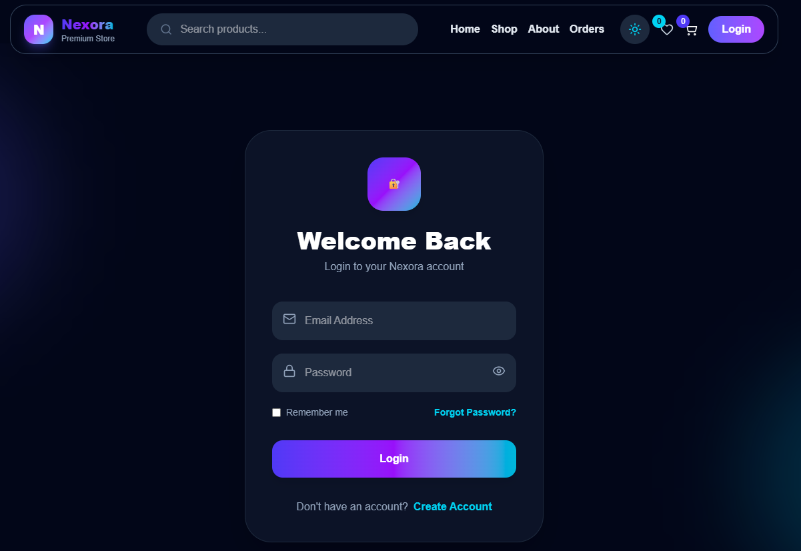
</p>

---

## 🏠 Home Page

<p align="center">
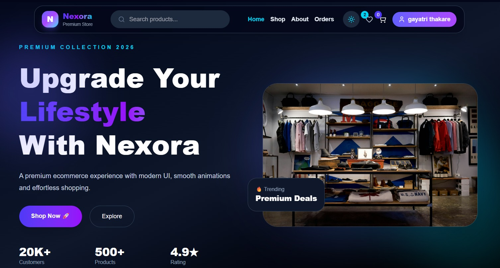
</p>

<p align="center">
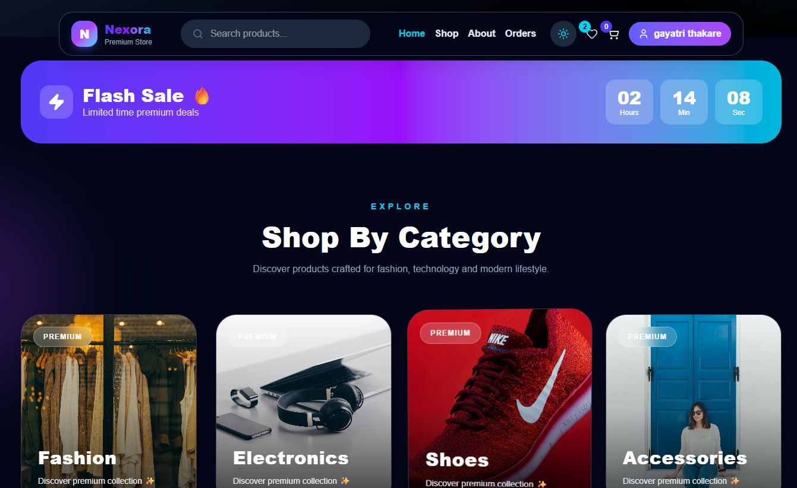
</p>

---

## 🛍️ Products Page

<p align="center">
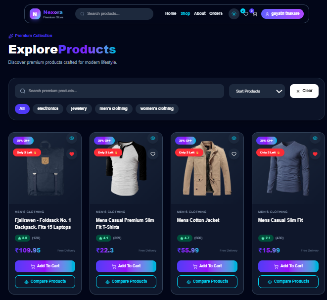
</p>

---

## 🛍️ Product Details

<p align="center">
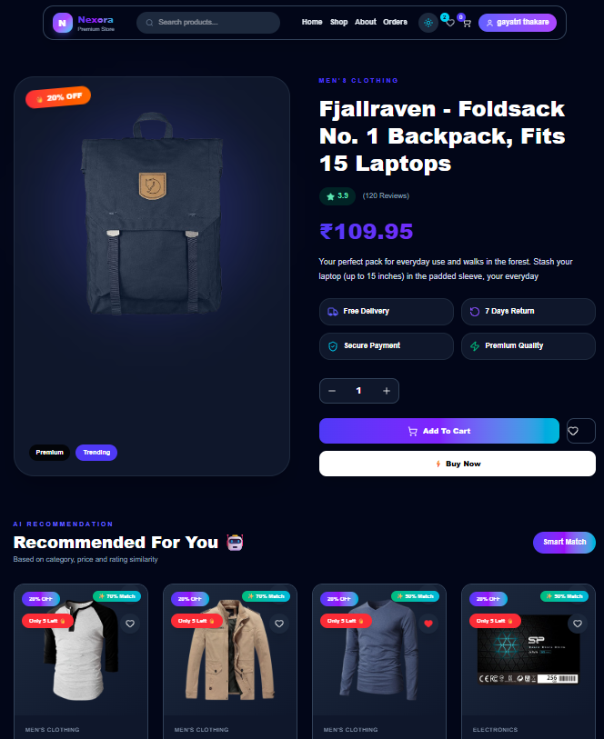
</p>

---

## ❤️ Wishlist

<p align="center">
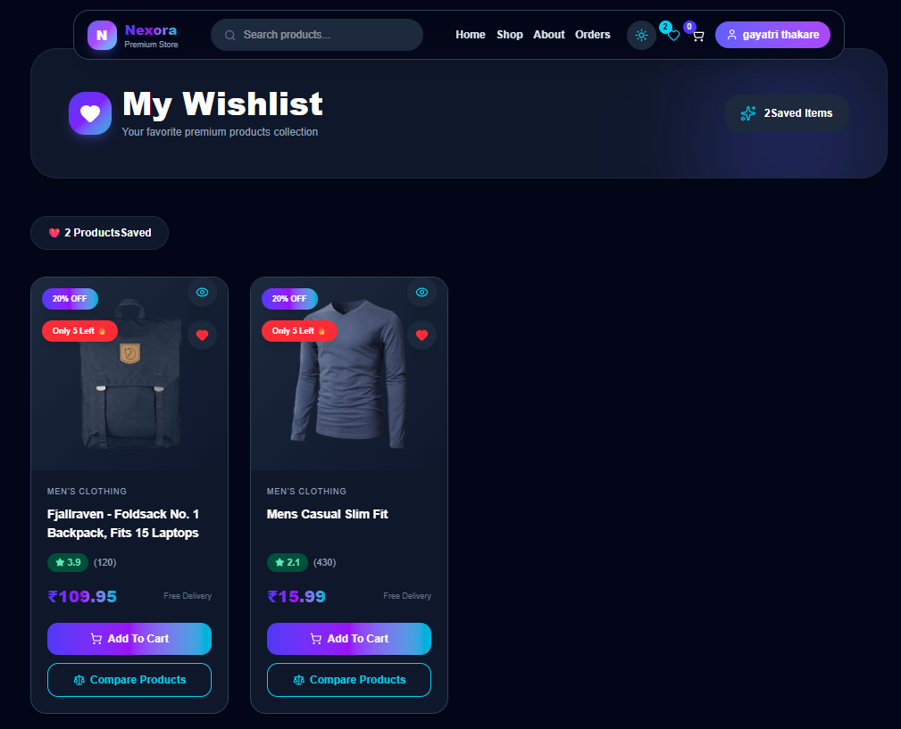
</p>

---

## 🛒 Cart

<p align="center">
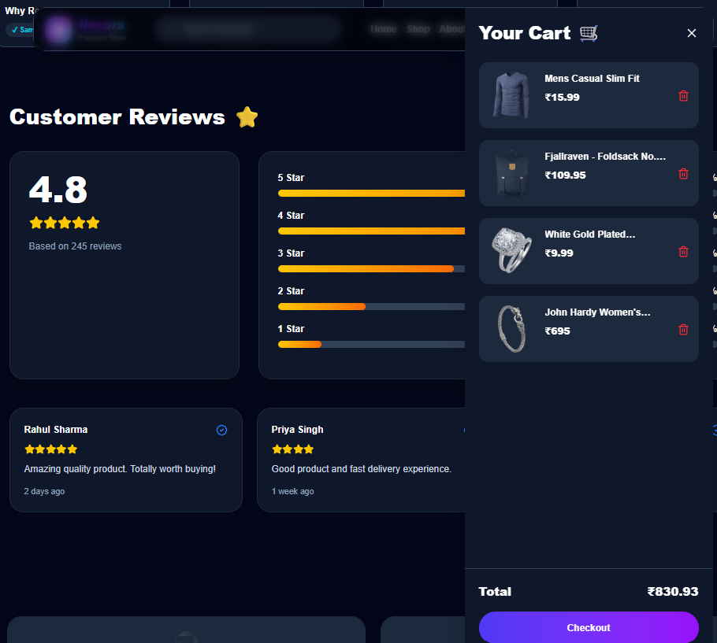
</p>

---

## 💳 Checkout

<p align="center">
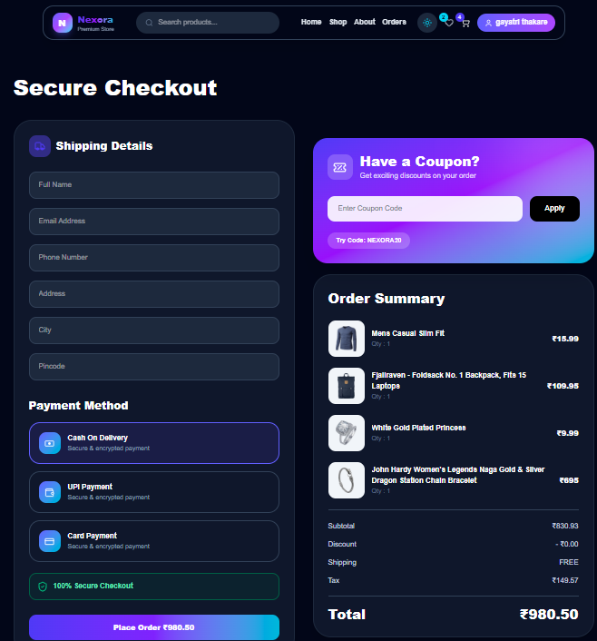
</p>

---

## 📦 Order Details

<p align="center">
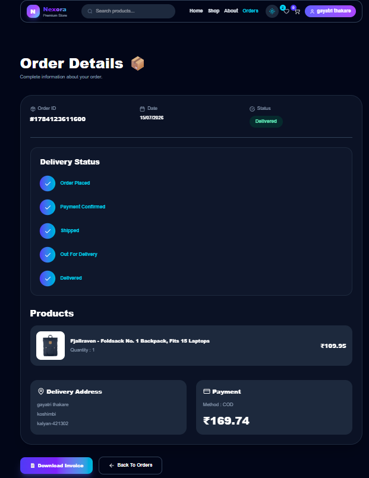
</p>

---

## 👨‍💼 Admin Dashboard

<p align="center">
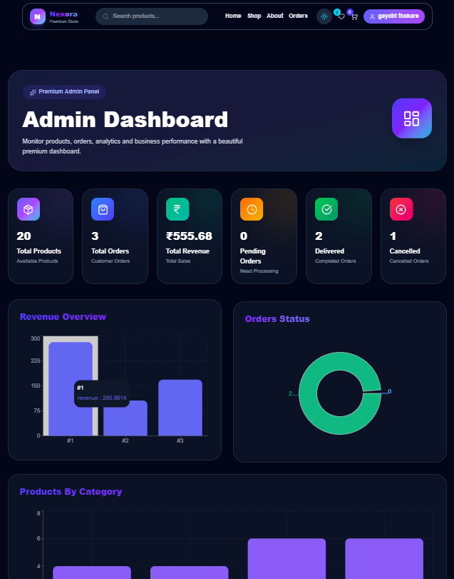
</p>

<p align="center">
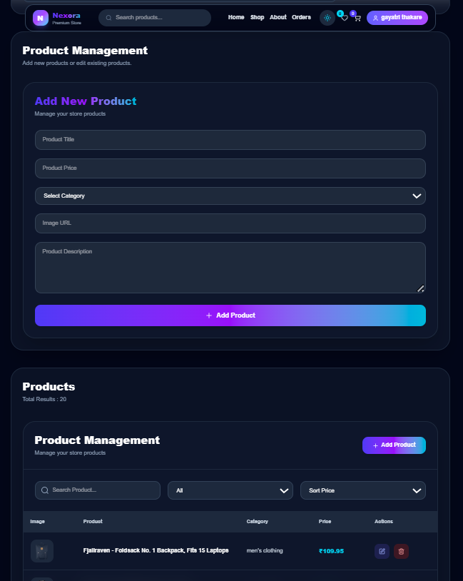
</p>

<p align="center">
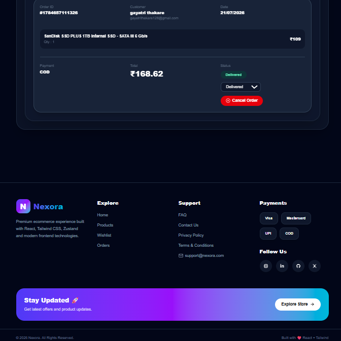
</p>

---

# 🖥️ Installation

Clone the repository

```bash
git clone https://github.com/gayatripixel/modern-ecommerce.git
```

Go to project

```bash
cd modern-ecommerce
```

Install dependencies

```bash
npm install
```

Run development server

```bash
npm run dev
```

Create production build

```bash
npm run build
```

---

# 🌍 Live Demo

[https://modern-ecommerce-virid.vercel.app/](https://modern-ecommerce-virid.vercel.app/)

---

# 👩‍💻 Author

## Gayatri Thakare

Frontend Developer

GitHub

[https://github.com/gayatripixel](https://github.com/gayatripixel)

LinkedIn

(https://www.linkedin.com/in/gayatri-thakare-32a9b4378/)

---

# ⭐ If you like this project

Give it a ⭐ on GitHub.

It motivates me to build more awesome projects.

---

<div align="center">

Built with ❤️ using React.js • Tailwind CSS • Zustand • React Query

</div>
```

